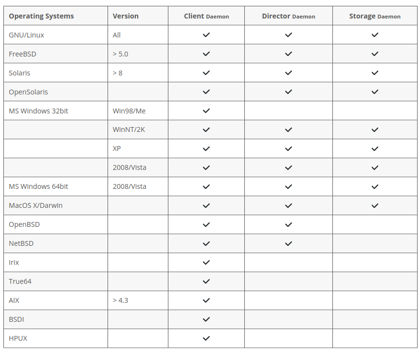

# AIT - Présentation 1 - Notes

> Cassandre Wojciechowski

## Sujet : Bacula

- Give a presentation of 16 minutes about the chosen subject. It will be followed by 2 minutes of Q&A.
  - Discuss advantages/disadvantages, costs, dependencies. If possible, compare with other solutions. Have a technical discussion, but also a strategic one (take the viewpoint of the CEO).
  - Include a live demo of the software/service.
  - Deliver a PDF of the slides.
- Write a document destined for a system administrator that contains a summary of the most important points to know about the software/service. A kind of cheat sheet with an overview, how to install/configure/use/... Do not simply repeat the slides. Deliver a PDF of the document.

______________________________________

**Is the code Open Source? Is at least the data format open and documented?**

Bacula est open source.

**Does it have cross-platform support?**

Yes : 



Src : https://www.bacula.org/what-is-bacula/supported-operating-systems/

**What backup media are supported?**

Tape and disk + ...

**How heavy is a backup in terms of time, CPU load, network load?**


**Can it do fully automated backups without user intervention?**

Oui, il est possible de planifier des backups à l'avance et ils se lancent automatiquement au moment prévu. 

**Are mobile devices supported that are connected only sporadically?**


**Is the data encrypted? In transit? At rest?**

TLS -> PSK = pwd set in the daemons

> Src : https://www.bacula.org/automatic-tls-encryption/

**What's the RPO?**

> Sauvegardes ultra régulières type toutes les 5 mn ou sauvegardes toutes les semaines ?

Bacula est très flexible et les sauvegardes peuvent être lancées comme l'admin le prévoit -> RPO variable. 

**How easy is it to restore a single file that was accidentally overwritten two weeks ago?**

"[...] offering many advanced storage management features that make it easy to find and recover lost or damaged files."

Normalement, cela doit être très simple car Bacula ne va jamais réécrire sur le même média (c'est le dernier recours).

"[...] the catalog maintains a record of all Volumes used, all Jobs run, and all Files saved, permitting efficient restoration."

> Src : https://www.bacula.org/what-is-bacula/


Director / Console / File / Storage / Monitor


### Avantages / inconvénients

| Avantages                                       | Inconvénients                                        |
| ----------------------------------------------- | ---------------------------------------------------- |
| Cross-platform                                  | Prise en main complexe                               |
| Automatisation & scheduling                     | Pas de scan de virus                                 |
| Toujours maintenu (dernière update : juin 2021) | Courbe d'apprentissage plutôt raide (configurations) |
| Détection d'erreurs                             |                                                      |
| Cloud & offsite backup                          |                                                      |
| Efficient deduplication (speeds up the backup)  |                                                      |
| Virtual environment support                     |                                                      |
| Large documentation & en plusieurs langues      |                                                      |

> Src : https://www.toolbox.com/tech/enterprise-software/articles/amanda-vs-bacula-backup-software/

```
PROS: 

Cloud and offsite backup

Bacula’s cloud backup works on the initial completion of local data and then transferring it to the cloud cache. It also offers data replication (offsite backup) to a geographically separated server via direct access or WAN.

Efficient deduplication

Deduplication engine enables a lesser duration of backups and reduction of storage space. Bacula cuts, stores, and indexes the file chunks on its Deduplication engine. It also uses compression for reducing the file size and speeding up the process.

Largest application support

Bacula consists of one of the largest databases for application support and includes all major platforms from Linux, Mac, Windows, AIX, Unix, Solaris. Application support consists of MS Exchange, MS SQL, My SQL, PostgreSQL, SAP HANA, Oracle, and SQLite.

Virtual environment support

Bacula positions itself as one of the few backup software providing support for almost all virtual environments. It uses XEN server API for accessing and backing up virtual machines and provides integration for VMware, MS Hyper-V, KVM, XEN, and Proxmox.
__________________________________________________________________________________________
CONS: 

Complex interface

The interface uses configuration files and text-based consoles and doesn’t have a GUI. This could make it difficult for sysadmins because bweb is an optional feature.

Cluttered configuration

The documentation can be intimidating when starting out because it’s not structured correctly. It could be challenging to find because of a steep learning curve.
```

-> Parler de l'optimisation du réseau (déduplication) + charge CPU engendrée
