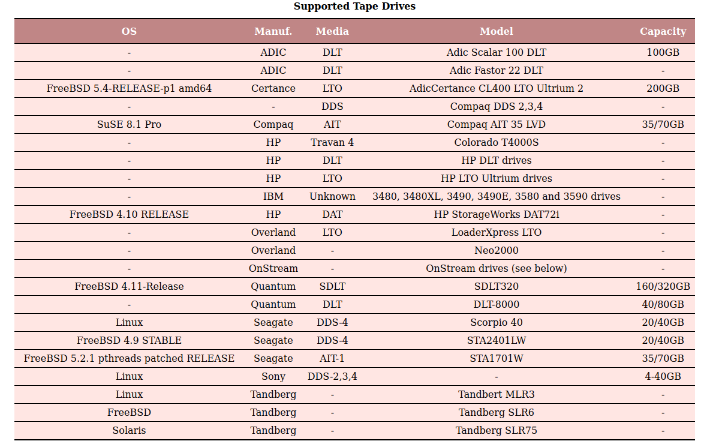

# Texte pour la présentation d'AIT 

## Avantages / Inconvénients

| Avantages                                       | Inconvénients                                      |
| ----------------------------------------------- | -------------------------------------------------- |
| Interface utilisateur graphique                 | Prise en main complexe (fichiers de configuration) |
| Cross-platform                                  | Pas de scan de virus                               |
| Automatisation & planification                  |                                                    |
| Toujours maintenu (dernière update : juin 2021) |                                                    |
| Sauvegarde Cloud & hors-site                    |                                                    |
| Déduplication des données                       |                                                    |
| Support d'environnements virtuels               |                                                    |
| Large documentation & en plusieurs langues      |                                                    |

La courbe d'apprentissage est assez raide, car il faut d'abord prendre en main les fichiers de configuration qui ne sont pas bien structurés. Cela prend donc du temps au début, mais permet d'économiser du temps et de l'argent quand on arrive au bout de cette courbe d'apprentissage. 

Par contre, Bacula dispose d'une interface graphique qui facilite les choses pour l'utilisateur. 

Aucun scan de virus n'est proposé par Bacula, donc si le système est infecté, le virus sera sauvegardé avec le reste des fichiers.

La solution Bacula est cross-platform, elle peut s'installer sur différentes distributions de Linux mais également de nombreuses versions de Windows ainsi que MacOS. On peut installer les différents composants sur FreeBSD, Solaris et OpenSolaris en plus. 

Un autre avantage très recherché est la possibilité d'automatiser les sauvegardes et de les planifier. Ainsi pas besoin d'être systématiquement présent pour lancer manuellement les back-ups au moment voulu. 

Bacula est toujours maintenu, la dernière update date de juin 2021, ce qui est plutôt récent et indique qu'en cas de souci, un patch sera rapidement disponible. 

Bacula offre une possibilité de sauvegarde dans le cloud et hors site. Ces deux possibilités permettent de protéger les données sauvegardées en cas de catastrophe naturelle survenant dans les locaux de l'entreprise. 

La déduplication élimine les copies excessives de données et réduit considérablement les besoins en capacité de stockage. Elle s'effectue en arrière plan et ne ralentit donc pas la sauvegarde. Bacula utilise également un mécanisme de compression pour réduire la taille des fichiers et accélérer les processus. Cette déduplication des données permet d'alléger les charges CPU et réseau engendrées. 

Bacula supporte les sauvegardes d'environnements virtuels tels que VMWare, MS Hyper-V, Proxmox ...

La documentation disponible est très complète et se trouve en plusieurs langues. 

## Discussion stratégique

Les médiums de backup supportés sont les disques, les DVD, des bandes, ... Ce qui laisse une assez grande liberté aux utilisateurs. 

> La liste suivante a été constituée selon des feedbacks de clients, elle n'est donc pas forcément complète.

> Src : https://www.bacula.org/11.0.x-manuals/en/main/Supported_Tape_Drives.html

Bacula est très flexible et les sauvegardes peuvent être planifiées au bon vouloir de l'administrateur, cela signifie que des backups peuvent être effectués jusqu'à une fois par heure. Cela nous donne un RPO (Recovery Point Objective - Perte de Données Maximale Admissible) très faible. Ce RPO dépend de la manière dont Bacula est configuré. 

Le RPO très faible et l'automatisation possible des sauvegardes engendrent une réelle économie pour l'entreprise, on économise le temps des employés et leur travail qu'on ne risque pas de trop perdre.

??? Support des appareils déconnectés ??? 

