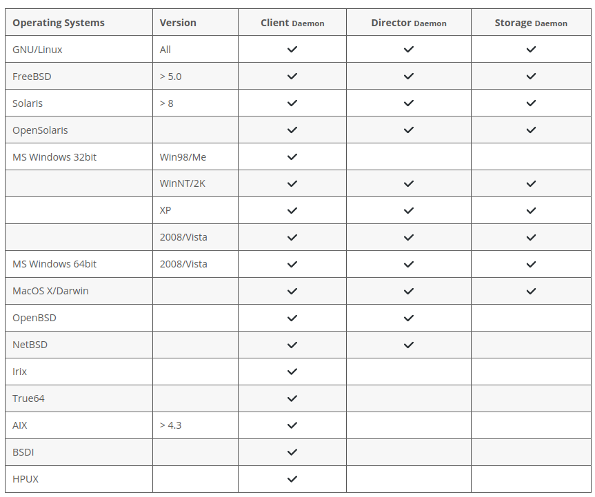
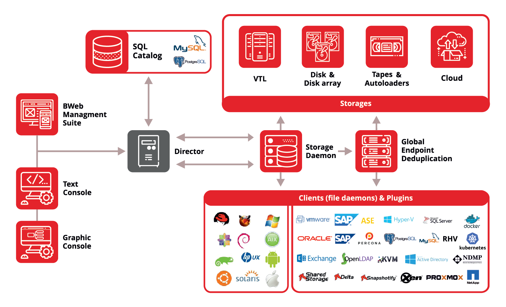
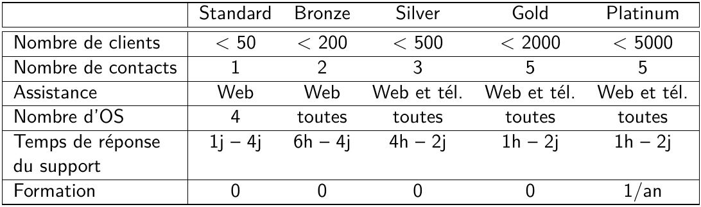
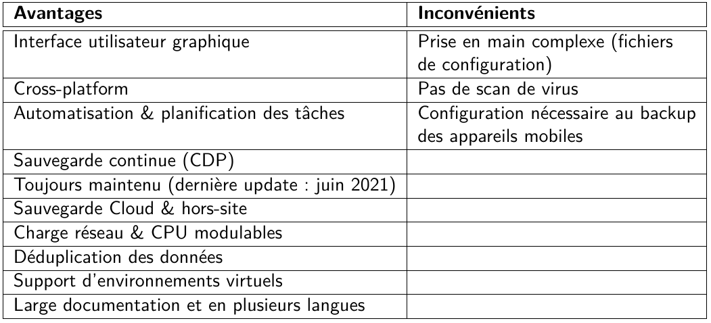

# Bacula

> Auteurs : Gwendoline Dössegger, Noémie Plancherel, Gaby Roch, Cassandre Wojciechowski
>
> Cours : Administration IT (AIT) 2021-2022

## Présentation 

Bacula est un logiciel de sauvegarde multi-platforme, développé dès 2000 par Kern Sibbald et dont la première version a été publiée en 2002. Il est constamment maintenu, documenté et mis à jour.

Bacula possède une version community qui est OpenSource. Ses différents composants/services peuvent tourner sur des systèmes d'exploitation gratuits ce qui ne nécessite pas des frais supplémentaires pour tester le logiciel. Bacula tourne également sur Windows et MacOS. 



Bacula est un set de programmes qui permet à un administrateur réseau de gérer des sauvegardes, la récupération et la vérification de données informatiques sur un réseau d'ordinateurs de différents types.

Il peut fonctionner sur un seul ordinateur et peut effectuer des  sauvegardes sur différents types de supports comme des bandes et des disques.

Bacula est un programme de sauvegarde client/serveur réseau. Il est "facile" d'utilisation et efficace en offrant de nombreuses fonctionnalités avancées de gestion du stockage pour faciliter la recherche et la récupération de fichiers perdus ou endommagés.

Il est évolutif et peut être utilisé pour de petits systèmes informatiques simples à des systèmes composés de centaines d'ordinateurs situés sur un grand réseau.


#### Architectures

Bacula est composé de 5 composants principaux :

- **Director** : il suppervise les opérations de sauvegarde, restauration, verification et archivage. C'est le composant principal et le point central des intéractions entre les composants.
- **Console** : c'est l'interface qui permet aux utilisateurs de communiquer avec le composant Director. Il existe 2 versions :  un shell et une interface web.
- **Client** : logiciel installé sur les clients qui doivent être sauvegardés. Il est spécifique à l'OS sur lequel il est présent. Il sera chargé de transmettre les données à sauvegarder et utilisés pour les opérations de récupérations. 
- **Storage** : composant responsable de l'écriture des sauvegardes sur les médias choisi. Les médiums de backup supportés sont les disques, les bandes et le cloud ce qui est assez classique pour les sauvegardes. 
- **Catalog** : est responsable de la maintenance des index de fichiers pour tous les fichiers sauvegardés.



#### Coûts

La seconde version de Bacula, entreprise, est payante sous forme d'abonnements mensuels. Elle présente des avantages non-négligeables. Il y a 6 types d'abonnements différents liés aux nombres de clients/serveurs à sauvegarder et le nombre de plateformes différentes (OS) :



Concernant le coût total annuel de chaque abonnement, il est nécessaire de prendre contact avec Bacula afin de donner nos besoins spécifiques ainsi que notre projet de sauvegarde et restauration pour dresser un devis. Il est également possible de télécharger une version d'essai de 1 mois afin de tester toutes les fonctionnalités ainsi que le support.


#### Avantages / Inconvénients

Bacula présente plus d'avantages que d'inconvénients : 



> Déduplication de données : factorisation de séquences de données identiques afin d'économiser l'espace utilisé (source: https://fr.wikipedia.org/wiki/D%C3%A9duplication). 


## Installation (Debian)

> Nous fournissons ici un guide d'installation pour Debian, il existe d'autres manières de procéder mais il serait trop long de toutes les inclure dans le présent document. 

Il faut d'abord installer les paquets nécessaires : 

```bash
$ apt-get update
$ apt-get install apt-transport-https
```

Ensuite, il faut importer la clé GPG disponible à https://www.bacula.org/downloads/Bacula-4096-Distribution-Verification-key.asc : 

```bash
$ cd /tmp
$ wget https://www.bacula.org/downloads/Bacula-4096-Distribution-Verification-key.asc
$ apt-key add Bacula-4096-Distribution-Verification-key.asc
$ rm Bacula-4096-Distribution-Verification-key.asc
```

Il faut ajouter les lignes suivantes au fichier `/etc/apt/sources.list.d/Bacula-Community.list` :

```
# Bacula Community
deb http://www.bacula.org/packages/@access-key@/debs/@bacula-version@
/@debian-version@/amd64/ @debian-version@ main
```

`@access-key@` se réfère à la clé d'accès personnalisée (celle-ci se trouve dans l'email d'enregistrement).

`@bacula-version@` se réfère à la version de Bacula en train d'être installée.

`@debian-version` se réfère au nom de code de la distribution (comme `jessie` ou `squeeze`). 

Il faut actualiser le gestionnaire de paquets : 

```bash
$ apt-get update
```

Si PostgresSQL n'est pas encore installé, il faut l'installer, puis lancer la commande d'installation des paquets de Bacula : 

```bash
$ apt-get install postgresql postgresql-client
$ apt-get install bacula-postgresql
```

A la question "Configure database for bacula-postgresql with dbconfig-common?", répondre "Oui" et entrer un mot de passe. 

Si on veut utiliser le plugin `Aligned` pour la déduplication de données sur des systèmes comme ZFS, il faut lancer la commande : 

```bash
$ apt-get install bacula-aligned
```

Il faut ouvrir les ports suivants pour que les différents composants de Bacula puissent communiquer : 

- Director: 9101 (TCP)
- Storage Daemon: 9103 (TCP)
- File Daemon: 9102 (TCP)

Si la base de données se trouve sur un autre serveur, il faut ouvrir les ports : 

- postgresql: 5432 (TCP and UDP)

Il faut ajuster les configurations IPtables pour autoriser ces communications. 

> Source : Bacula Community Installation Guide - A short guide to installing Bacula (version 1.4, août 2018)

## Configuration

## Utilisation

